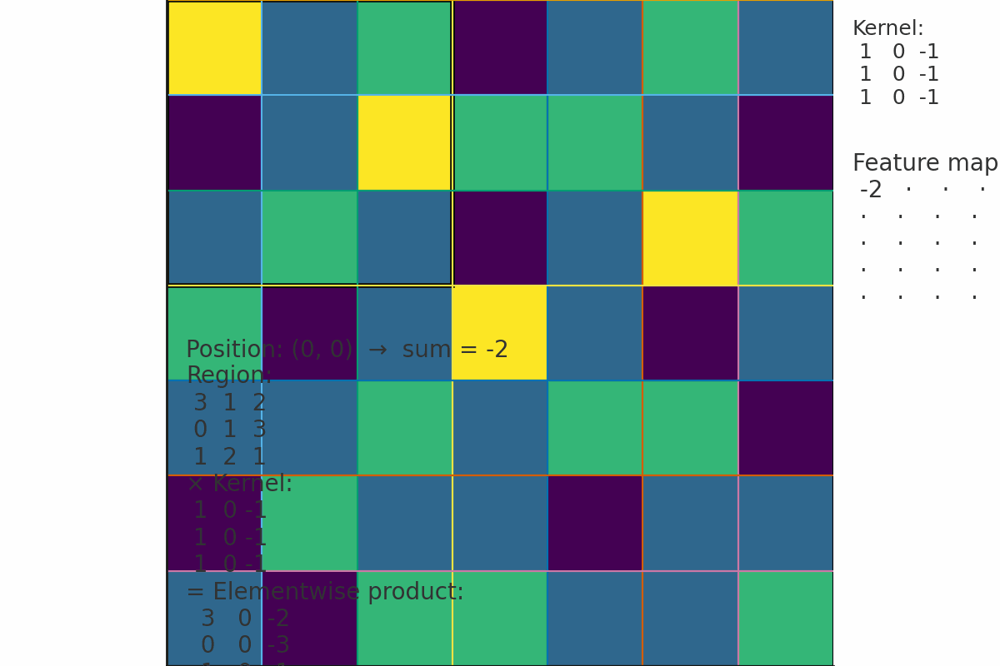

# Convolutional Neural Networks (CNNs)

---

## Slide 1 — Title

**Convolutional Neural Networks (CNNs)**

Short intro: models designed to process grid-like data (images).

Learning objectives:
- Understand convolution, filters, stride, padding.
- See pooling and feature maps.
- Build a tiny CNN in Keras and train on MNIST.

---

## Slide 2 — Why CNNs?

- Images have local structure and spatially-correlated pixels.
- Convolutions exploit locality and parameter sharing.
- Far fewer parameters than dense networks for images.
- Translation equivariance: same feature detected anywhere.

---

## Slide 3 — Convolution (intuition)

- Apply a small kernel (filter) that slides over the image.
- Each location computes a dot-product between kernel and image patch -> one activation.
- The resulting 2D map is called a *feature map* or *activation map*.

**Kernel size** typically 3×3, 5×5. **Depth** = number of filters.

---

## Slide 4 — Convolution (math)

For 2D discrete signals (single channel):

\[ (I * K)(i, j) = \sum_{u} \sum_{v} I(i+u, j+v)\;K(u, v) \]

Where *I* is the input image and *K* is the kernel. In deep learning libraries the kernel is flipped in the formal definition, but implementation abstracts that away.



---

## Slide 5 — Padding & Stride

- **Padding**: add border (usually zeros) so output size is controlled.
  - `valid` = no padding, `same` = pad to keep same spatial dims (when stride=1).
- **Stride**: step size when sliding kernel. Larger stride -> smaller output.

Output spatial size formula (square input W, kernel k, padding p, stride s):

\[ \text{out} = \left\lfloor \frac{W - k + 2p}{s} \right\rfloor + 1 \]

---

## Slide 6 — Multiple channels & filters

- If input has C channels (e.g., RGB C=3), each filter has shape (k, k, C).
- A layer with F filters produces F feature maps -> output shape (H', W', F).
- Parameter count per layer: F * (k*k*C) + F (biases).

---

## Slide 7 — Activation & Non-linearity

- Typical: ReLU after convolution: `ReLU(conv(x))`.
- BatchNorm often used to stabilise and speed training.

---

## Slide 8 — Pooling

- Downsamples spatial dimensions: MaxPooling, AveragePooling.
- Reduces computation and increases receptive field.
- Typical pool size: 2×2 with stride 2.

---

## Slide 9 — Typical small CNN architecture

Input -> [Conv(3x3, 32) -> ReLU] -> [Conv(3x3, 64) -> ReLU] -> MaxPool(2x2)
-> Flatten -> Dense(128) -> Dropout -> Softmax

---

## Slide 10 — Modern patterns

- Small (3×3) kernels stacked (VGG-style) instead of large kernels.
- Residual connections (ResNet) allow deeper nets.
- Depthwise separable convs (MobileNet) reduce compute.
- Transfer learning: reuse pretrained conv backbones.

---

## Slide 11 — Training tips

- Normalize inputs (rescale to [0,1] or mean-zero).
- Use data augmentation (flips, shifts, rotations) to reduce overfitting.
- Start with Adam optimizer & moderate LR (e.g. 1e-3).
- Monitor validation loss & use early stopping.

---

## Slide 12 — Common mistakes

- Forgetting to add channel dimension for grayscale images (shape mismatch).
- Using too-large fully connected layers early (huge params).
- Not shuffling data, leaking test set into training.

---

## Slide 13 — Demo: tiny CNN in Keras (MNIST)

Below is minimal, runnable code that should work with TensorFlow 2.x (`tensorflow` package).

```python
# tiny_cnn_mnist.py
import tensorflow as tf
from tensorflow.keras import layers, models
from tensorflow.keras.utils import to_categorical

# Load data
(x_train, y_train), (x_test, y_test) = tf.keras.datasets.mnist.load_data()

# Preprocess: reshape, scale, one-hot
x_train = x_train.astype('float32') / 255.0
x_test  = x_test.astype('float32')  / 255.0

# add channel dimension (MNIST is grayscale)
x_train = x_train[..., None]  # shape (N, 28, 28, 1)
x_test  = x_test[..., None]

y_train = to_categorical(y_train, 10)
y_test  = to_categorical(y_test, 10)

# Build model
model = models.Sequential([
    layers.Input(shape=(28,28,1)),
    layers.Conv2D(32, (3,3), activation='relu', padding='same'),
    layers.MaxPooling2D((2,2)),
    layers.Conv2D(64, (3,3), activation='relu', padding='same'),
    layers.MaxPooling2D((2,2)),
    layers.Flatten(),
    layers.Dense(128, activation='relu'),
    layers.Dropout(0.5),
    layers.Dense(10, activation='softmax')
])

model.compile(optimizer='adam',
              loss='categorical_crossentropy',
              metrics=['accuracy'])

model.summary()

# Train (small number of epochs for demo)
model.fit(x_train, y_train, epochs=5, batch_size=128,
          validation_split=0.1)

# Evaluate
loss, acc = model.evaluate(x_test, y_test)
print(f'Test accuracy: {acc:.4f}')
```

Notes:
- This is intentionally simple. On MNIST expect ~0.98+ accuracy after sufficient training/augmentation.
- To run on CIFAR-10: change input shape to (32,32,3), load `tf.keras.datasets.cifar10`, and remove the `[..., None]` reshape.

---

## Slide 14 — Exercises for students

1. Modify the demo to add BatchNormalization after each Conv2D — measure effect on training speed.
2. Add data augmentation (random flips, rotations) using `tf.keras.preprocessing.image.ImageDataGenerator` or `tf.keras.layers.RandomFlip`/`RandomRotation`.
3. Replace Flatten + Dense by global average pooling and a single Dense — compare number of parameters.

---

## Slide 15 — Further reading & resources

- Chris Olah blog posts (intuition + visualisations).
- Stanford CS231n notes (convolutions, backprop, architectures).
- Keras documentation: `layers.Conv2D`, `layers.MaxPooling2D`.

---

## Slide 16 — Quick debugging checklist

- Are input shapes correct? (channels last vs channels first)
- Do labels match output shape (one-hot vs sparse)?
- Is the learning rate reasonable?
- Try a very tiny model — if it can't overfit a few examples, bug in code.

---

## Slide 17 — Wrap-up

- CNNs are the go-to for image tasks because they exploit locality & parameter sharing.
- Key hyperparameters: kernel size, number of filters, stride, padding, pool size.
- Hands-on practice: implement, visualise filters/features, experiment with augmentation.


---

